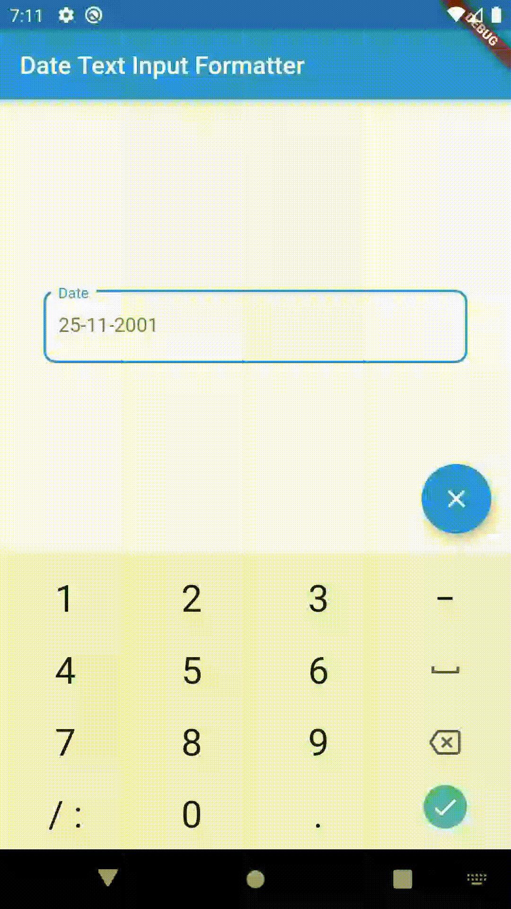

#  DateInputTextFormatter

### Usage

**Add to pub**

'''dart
    dependencies:
	 date_input_text_formatter: ^0.0.1
'''

**Import**

'''dart
    import  'package:date_text_input_formatter/date_text_input_formatter.dart';
'''

**Use**

'''dart
    inputFormatters:  <TextInputFormatter>[
    DateTextInputFormatter(delimiter:  "-", format: [dd, mm, yyyy])
    ],
    
    // dd-mm-yyyy
'''

or

'''dart
    inputFormatters:  <TextInputFormatter>[
    DateTextInputFormatter( format: [dd, mm, yyyy])
    ],
    
    // dd/mm/yyyy
'''